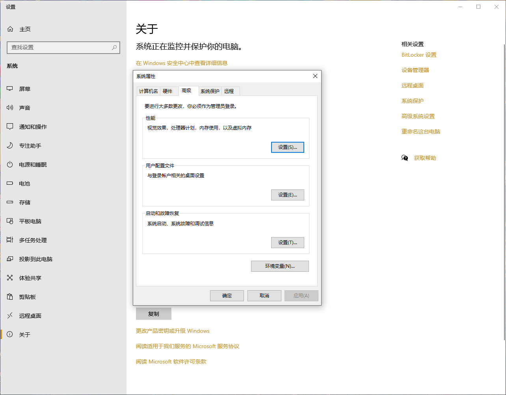
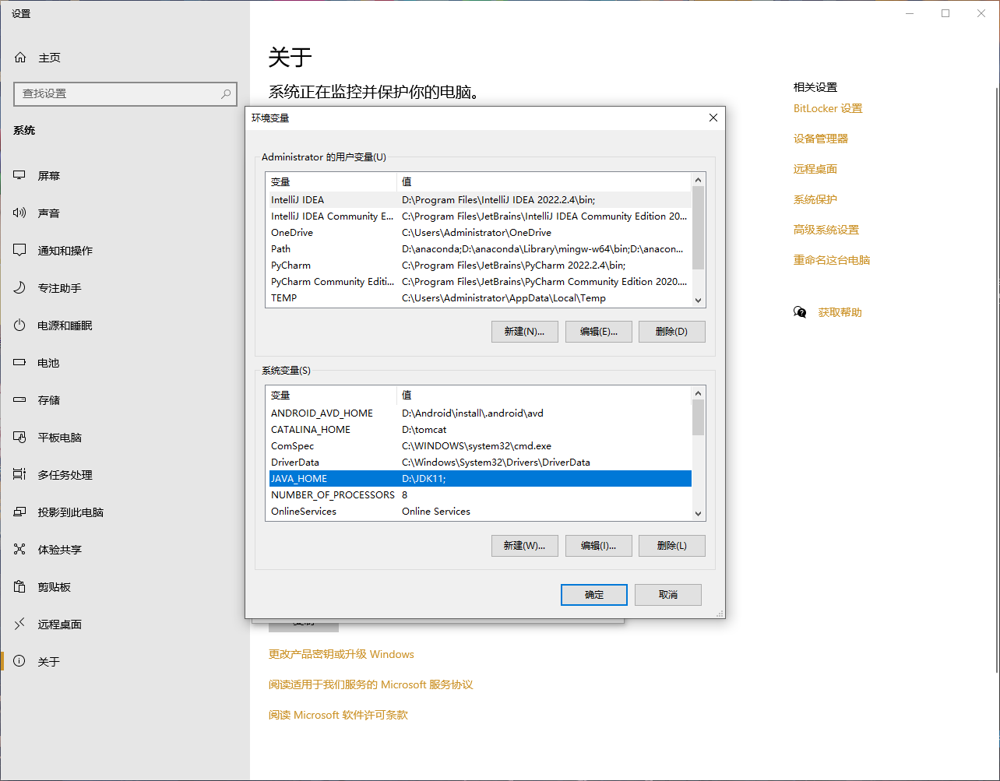
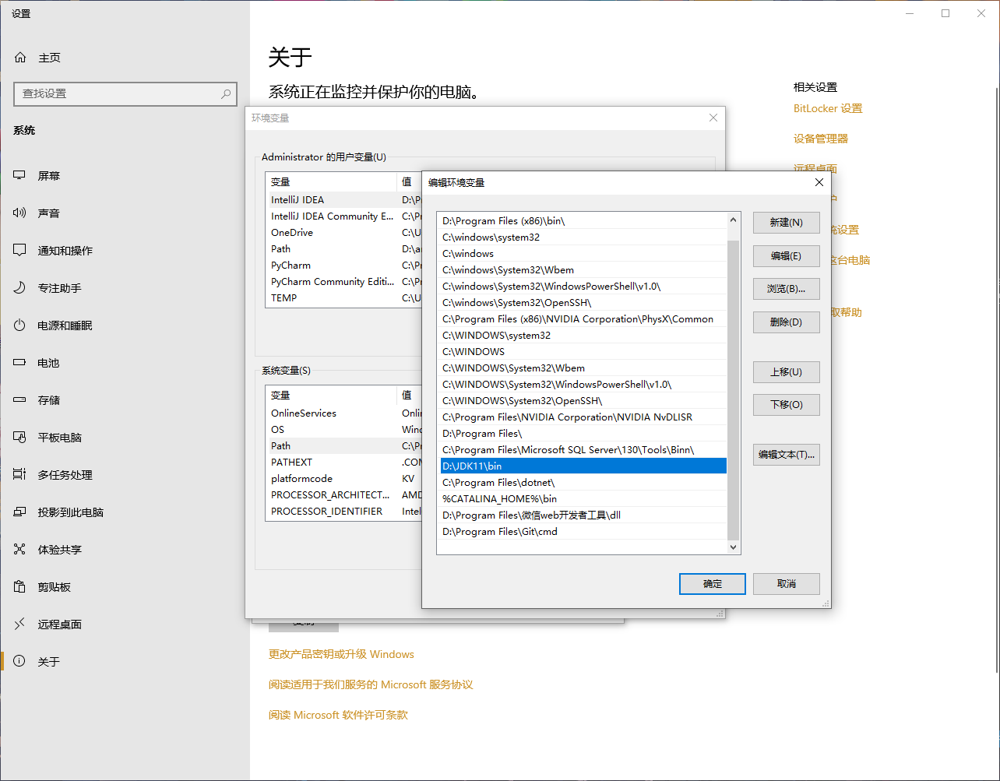
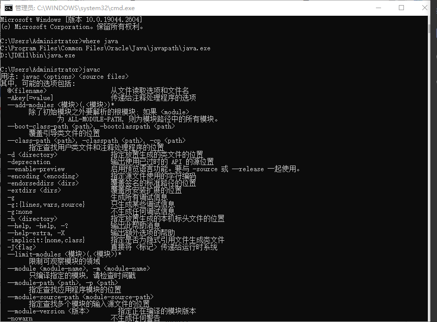
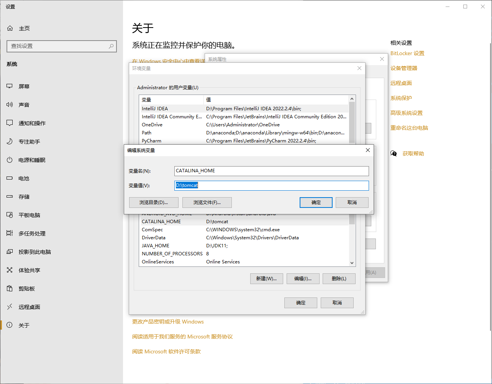
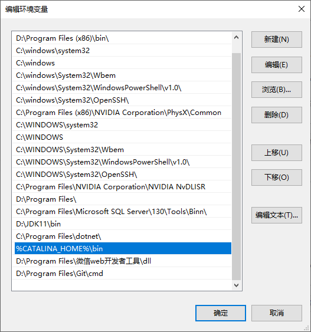
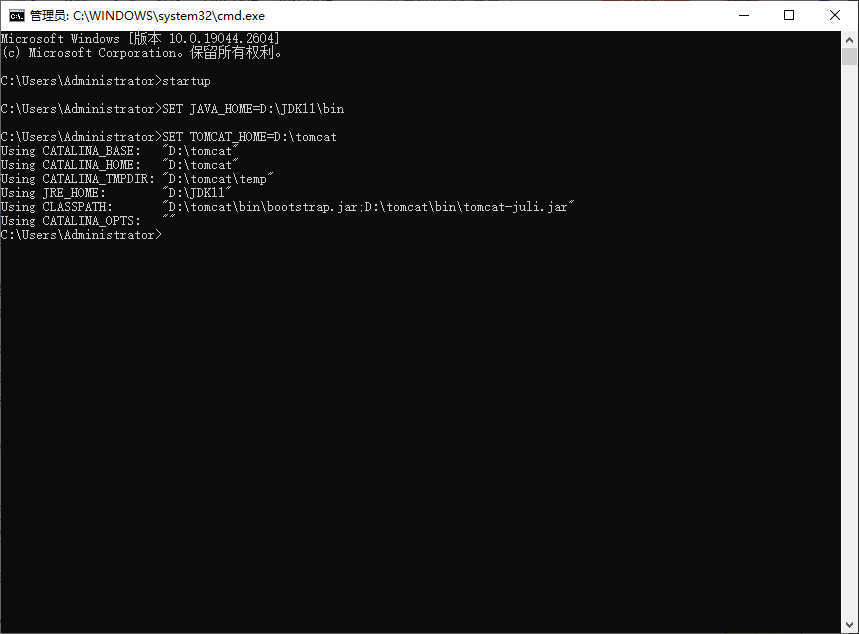
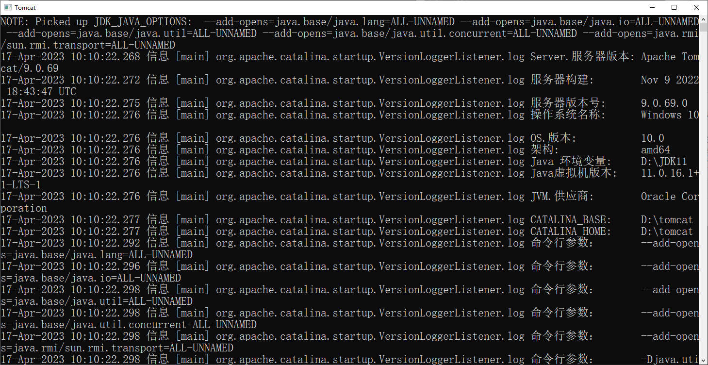
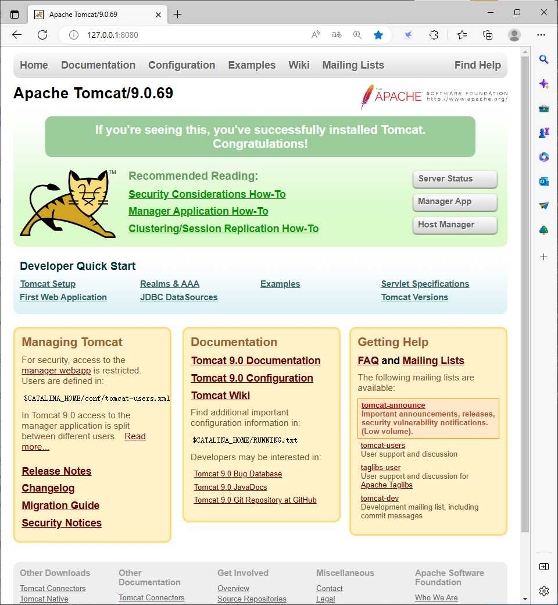

# Java
>此模块为Java This is Java! 会不时更新，坚持热爱！

### 1.入门--配置Java环境
>环境：Windows 10，Jdk11 目的：解决配置过程中的疑难问题 日期：2023/4/12 

##### *··用户变量-No!环境变量-Yes!*
>一点想法，写在前面

&nbsp; &nbsp; 当我们第一次使用高级系统配置Java环境的时候会感觉有点“麻烦”或者说有些稍微的“专业”了一些，其实既然选择了计算机就要不怕困难，勇敢的去解决问题，不要怕麻烦，这才是成长的关键。 
如下说一下我个人的理解，**如图1.1所示：**

图1.1

&nbsp; &nbsp; 在打开高级，进入环境变量的时候会出现两个框框，上面一般是用户变量，下面是系统变量，以我个人理解，如果去用户变量配置，那么此台电脑的其他用户将不会与该用户同步配置Java系统环境，如果是公司或是一个组织请有选择的去配置，个人是建议在系统变量里面配置相关环境的！

##### *··具体配置流程*
> 注意：本篇配置的java本地环境是基于我按照的位置，因为每个人安装jdk的位置不一样，需要各位去修改一下对应位置 !!!
<!--占位-->
&nbsp; &nbsp; 基本流程：1.右击此电脑，点击属性。2.找到高级系统设置，点击。**如图1.2所示** 

图1.2

3.找到高级选项卡下的环境变量，点击。**如图1.3所示**

图1.3

4.**注意以后配置环境一般只改变系统变量！** 新建一个变量名：JAVA_HOME；变量值：D:\JDK11;**（*变量值为你存放JAVA的位置，记得修改！！！*）** 5.找到变量名为Path，点击打开。6.在里面新建一个变量值：**存放Java的位置下的bin目录**，**如图1.4所示**

图1.4

**6.验证：** 配置完成后，请打开cmd，输入where java，查看是否有java安装的环境，之后输入javac，进一步验证配置是否成功，**如图1.5所示**

图1.5

解释步骤：首先java需要我们自己去配置电脑上面的系统环境，这个过程就是告诉系统我安装了一个Java编译环境，你需要在工作的时候去配合它的工作，它的位置在哪哪哪，我什么时候打开的时候需要你去找到它。其中找如何找它就是我们在配置系统变量的过程。（*个人理解*）

### 2.web入门--配置Tomcat
>环境：Windows 10，Jdk11 目的：解决配置过程中的疑难问题 日期：2023/4/17 

##### *··具体配置流程*
>与Java配置相类似！注意查看修改自己Tomcat安装的位置。注意一点就是假如Java环境没配好的话配置tomcat环境也会出错的。

基本流程：与Java配置1-3步完全相同。4.新建一个变量名：CATALINA_HOME；变量值：D:\tomcat;**（*变量值为你存放Tomcat的位置,记得修改！！！*）**。*如图2.1所示*

图2.1

5.找到变量名为Path，点击打开。6.在里面新建一个变量值：**存放Java的位置下的bin目录**，**如图2.2所示**

图2.2

**6.验证：** 配置完成后，请打开cmd，输入startup，**如图2.3所示**。

图2.3

会自动打开tomcat启动窗口，**记得不要关闭Tomcat窗口**，下一步要用！**如图2.4所示**

图2.4

打开Edge或者google浏览器，在地址栏输入127.0.0.1:8080，**如图2.5所示**

图2.5

🆗成功！ 
总结:类似于Java的配置过程，只是需要注意，如果Java没配置成功，tomcat也会报错的，大多数的错误是环境配置的错误，还有就是可能在图2.4的时候会出现一些乱码，属于正常编码出错，可以忽略，也可以去修改成正常显示的内容。 解决方法：打开安装tomcat的目录，打开conf文件夹，找到logging.properties，用记事本打开，大概在51行会有java.util.logging.ConsoleHandler.encoding这行代码，如果没有,在最后添加

>java.util.logging.ConsoleHandler.encoding = GBK

如果有就把UTF修改为GBK，如上代码

### 3.hello
>pass

pass

### 4.world
>pass

pass
